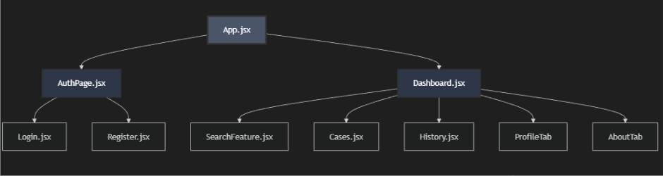

# Compliance Case Management Platform

A full-stack web application for compliance officers and managers to screen customers against global sanctions lists using data from OpenSanctions.

---

## Table of Contents

- [App Features](#app-features)
- [Technology Stack](#technology-stack)
- [Planning Phase](#planning-phase)
- [Component Tree & Architecture](#component-tree--architecture)
- [Backend Integration: Database & API Management](#backend-integration-database--api-management)
- [Secure Configuration with .env Variables](#secure-configuration-with-env-variables)
- [Project Objectives & Takeaways](#project-objectives--takeaways)
- [Project Challenges](#project-challenges)
- [Project Enhancements](#project-enhancements)
- [How to Run This App](#how-to-run-this-app)
- [Contributing](#contributing)
- [Acknowledgments](#acknowledgments)

---

## App Features

- **Search 100,000+ Sanctioned Individuals**: Search by name and/or country from a comprehensive database of sanctioned persons, politically exposed persons (PEPs), and persons of interest
- **Role-Based Access Control**:
  - **Officers**: Search individuals, add to cases, update case status
  - **Managers**: All officer features + view all pending/flagged cases, reassign cases to officers
- **Case Management**:
  - Add search results to cases with default "Pending" status
  - Update case status (Pending, Flag 1-5) for risk assessment
  - Reassign cases between officers (Manager only)
  - Move cleared cases to History for audit trail
- **Persistent Data**: All cases and history stored in localStorage for data persistence across sessions
- **User Authentication**: Secure login/registration with JWT tokens (access & refresh tokens)
- **Comprehensive Person Details**: View birthdate, gender, nationality, address, sanctions topics (SANCTION, PEP, CRIME, TERROR, etc.)
- **Country Filtering**: Search with 200+ countries mapped from country codes to full names

---

## Technology Stack

### Frontend

- **React**
- **Axios**
- **CSS3**
- **localStorage**

### Backend

- **Node.js & Express**
- **PostgreSQL**
- **JWT (jsonwebtoken)**
- **pg (node-postgres)**

### Data Source

- **OpenSanctions** - Global database of sanctions lists, PEPs, and compliance data (100k+ entities)

---

## Planning Phase

**Step 1 - Planning**: Trello, WireFrames, DB Design  
**Step 2 - Backend**: OpenSanctions API, Controllers/models/routes/data, PostgreSQL database, env  
**Step 3 - Frontend**: Login, Register, SearchFeature, Dashboard, Cases, History, Authpage, env  
**Final Step - Integration**: Integrate Backend and Frontend, Bug fixes, Styling app

---

## Component Tree & Architecture



### Data Flow Architecture

1. **User Authentication**: Login/Register → authService.js → Backend API → JWT tokens stored in localStorage
2. **Search Flow**: SearchFeature → Backend API (name_entities table) → Display results → Add to Cases
3. **Case Management**: Dashboard (state) → Cases component → localStorage persistence
4. **State Management**: React useState/useEffect with localStorage for persistence

---

## Backend Integration: Database & API Management

### Data Source: OpenSanctions

- **OpenSanctions** - Global database of sanctions lists, PEPs, and compliance data
- **100,000+ entities** loaded into local PostgreSQL database
- **Data includes**: Sanctioned individuals, Politically Exposed Persons (PEPs), persons of interest
- **Bulk data approach** for cost-effective development without real-time API costs

### Database Schema (PostgreSQL)

- **users**: id, name, email, password, gender, role (officer/manager), createdAt
- **name_entities**: id, caption, entity_id, nationality, birthdate, gender, first_name, last_name, name_aliases, position, address, properties (JSONB), created_at
- **cases**: id, officer_id, entity_id, input_name, match_score, priority, status, created_at

### API Endpoints

#### Authentication Endpoints:

- `POST /api/users/register` - Register new compliance officer
- `POST /api/users/login` - User authentication
- `GET /api/users/` - Retrieve all users (Manager only)
- `GET /api/users/{id}` - Get user by ID
- `PUT /api/users/{id}` - Update user (Manager only)
- `DELETE /api/users/{id}` - Delete user (Manager only)

#### Sanctions Search Endpoints:

- `GET /api/name-entities/search` - Search OpenSanctions database
- `GET /api/name-entities/countries` - Retrieve available countries

#### Case Management Endpoints:

- `GET /api/cases/` - Retrieve all cases
- `POST /api/cases/` - Create new case
- `GET /api/cases/{id}` - Get case by ID
- `PUT /api/cases/{id}` - Update case status/details
- `DELETE /api/cases/{id}` - Delete case
- `POST /api/cases/{caseId}/assign` - Assign case to officer (Manager only)
- `POST /api/cases/{caseId}/entities` - Add sanctioned entity to case

---

## Secure Configuration with .env Variables

### Backend Environment Variables

Create a `.env` file in the `backendExpress` directory:

```env
# Database Configuration
DB_USER=postgres
DB_HOST=localhost
DB_NAME=capstone
DB_PASSWORD=your_database_password
DB_PORT=5432

# JWT Secrets
JWT_SECRET=your_jwt_secret_key_here
JWT_REFRESH_SECRET=your_refresh_secret_key_here

# Server Port
NODE_ENV=development
PORT=3000
```

### Frontend Environment Variables

Create a `.env` file in the `frontend` directory:

```env
PORT=3001
REACT_APP_API_URL=http://localhost:3000/api
```

## Project Objectives & Takeaways

### Learning Objectives

**1.** To develop a full-stack web application using the PERN stack
**2.** Automate safety checks so the system can flag out if a customer is a "bad actor" or a "red flag" based on international lists.
**3.**Implement automated Sanctions & PEP (Person of Interest) screening to gain experience in real-time data integration with global compliance watchlists.

### Key Takeaways

- Build a full-stack web app using modern tools (PostgreSQL, Express, React, Node) to show I can handle a project from start to finish.
- Gain hands-on experiences by identifying Politically Exposed Persons (PEPs) through complex data modeling.
- Developed a better understanding of regulatory technology, focusing on how automated compliance adds value to the financial ecosystem.
- Learned to prioritize core "must-have" features to deliver a complete RegTech MVP within a short two-week window.

---

## Project Challenges

### 1. Implementing Role-Based State Logic

**Challenge**: Originally, the app was built for Officers to view their own tasks. Introducing a Manager role meant the app had to "switch gears" to allow one person to edit another person's workload, which broke the original file structure.
**Solution**: I reconfigured the component logic using setActiveTab to manage different view states.

### 2. Cost-Effective Data Engineering (ETL)

**Challenge**: Real-time API calls to global sanctions lists are expensive for a development project. I needed a way to access high-quality data without the high-quality price tag.
**Solution**: I shifted to a "Bulk Data" strategy. I downloaded massive datasets from OpenSanctions, built a custom extraction script, and manually mapped that data into my own PostgreSQL database. While stakes requiring a full redo if the data mapping was off—this saved significant costs and gave me full control over the data.

### 3. Architectural Planning & Component Hierarchy

**Challenge**: Before writing a single line of React, I had to figure out how dozens of files would "talk" to each other without creating a mess of "spaghetti code."

**Solution**: I spent the initial phase mapping out a Component Hierarchy. By strategizing which components should "own" the data (State) and which should just "display" it (Props), I ensured the app stayed fast and easy to debug as it grew in complexity.

### 4. Logical Modeling for Case Integrity

**Challenge**: Re-assigning a case isn't just moving a name from Column A to Column B. It required extra time to think through the "ripple effect"—what happens to the case history, the timestamps, and the original officer's dashboard?

**Solution**: I took a "Logic-First" approach, dedicating extra time to draw out the data flow. I ensured that when a re-assignment happens, the database updates correctly when managers re-assigns cases to officers.

### 6. Authentication Token Management

**Challenge**: Managing JWT access tokens and refresh tokens securely
**Solution**:

- Stored tokens in localStorage (trade-off: security vs convenience)
- Implemented `authService.js` to centralize token management
- Created middleware to verify tokens on protected routes

---

## Project Enhancements

Future enhancements to scale this platform into a production-grade compliance system:

### 1. Multi-Entity Type Support

**Current State**: The search feature currently focuses exclusively on individuals (sanctioned persons and PEPs).

**Enhancement**: Expand the search functionality to include all OpenSanctions entity types:

- **Organizations & Companies** - Search sanctioned businesses, shell corporations, and entities tied to financial crimes
- **Vessels** - Screen maritime vessels flagged for sanctions violations or illegal activities
- **Aircraft** - Identify planes associated with sanctioned entities or illicit operations
- **Addresses** - Flag physical locations linked to criminal networks or sanctioned operations
- **Other Entity Types** - Support for any additional entity classifications in the OpenSanctions dataset

**Technical Approach**: Refactor the database schema to support polymorphic entity storage, update API endpoints to handle entity-type filtering, and redesign the UI to accommodate different data structures for each entity type.

### 2. Route-Based Navigation Architecture

**Current State**: The Dashboard uses `setActiveTab` state management to switch between views (Search, Cases, History), which keeps all components mounted simultaneously.

**Enhancement**: Implement React Router for true route-based navigation:

- `/dashboard/search` - Search feature
- `/dashboard/cases` - Case management
- `/dashboard/history` - Historical records
- `/dashboard/profile` - User profile

**Benefits**:

- **Scalability** - Better handles apps with 10+ views without performance degradation
- **Deep Linking** - Users can bookmark specific pages and share direct links
- **Browser History** - Proper back/forward button functionality
- **Code Splitting** - Load components only when needed, reducing initial bundle size
- **SEO-Friendly** - Each route gets its own URL for better discoverability

### 3. Advanced Fuzzy Matching & Smart Search

**Current State**: Search uses basic SQL `ILIKE` pattern matching, which requires exact spelling and doesn't handle typos or phonetic variations.

**Enhancement**: Implement intelligent matching algorithms:

- **Levenshtein Distance** - Calculate character-by-character similarity to catch typos ("Micheal" → "Michael")
- **Soundex/Metaphone** - Phonetic matching for names that sound similar but are spelled differently ("Smith" → "Smythe")
- **Trigram Similarity** - PostgreSQL's `pg_trgm` extension for substring matching
- **Weighted Scoring** - Rank results by match confidence (95% match, 87% match, etc.)

**Impact**: Dramatically reduces false negatives in compliance screening, ensuring suspicious individuals aren't missed due to spelling variations or data entry errors.

### 4. Manager Analytics Dashboard

**Current State**: Managers view cases in a flat list format without visual analytics.

**Enhancement**: Build a comprehensive analytics dashboard featuring:

- **Pie Charts** - Visual breakdown of pending vs. flagged vs. cleared cases
- **Status Distribution** - See at-a-glance how many cases are at each risk level (Flag 1-5)
- **Officer Workload** - Compare case counts across team members to balance assignments
- **Trend Analysis** - Track case resolution rates over time (weekly/monthly)
- **Risk Heat Map** - Identify high-risk patterns by country, entity type, or time period

**Technology Stack**: Integrate Chart.js or Recharts for interactive visualizations, with real-time updates as case statuses change.

### 5. Comprehensive Audit Trail & Logging System

**Current State**: No tracking of user actions, case modifications, or system events.

**Enhancement**: Implement enterprise-grade audit logging:

- **User Activity Logs** - Track every search query, case creation, status update, and reassignment
- **Change History** - Maintain a full audit trail showing who modified what and when
- **Compliance Reporting** - Generate downloadable reports for regulatory audits
- **Timestamped Records** - All actions logged with precise timestamps and user attribution
- **Immutable Logs** - Prevent tampering by storing logs in append-only database tables
- **Search & Filter** - Allow managers to query logs by date range, user, action type, or entity

**Regulatory Value**: Critical for financial institutions that must demonstrate compliance with KYC (Know Your Customer) and AML (Anti-Money Laundering) regulations. Auditors can verify that all screening decisions were properly documented and justified.

---

## How to Run This App

### Prerequisites

- **Node.js** (v14 or higher)
- **PostgreSQL** (v12 or higher)
- **npm** or **yarn** package manager
- **Git** (to clone the repository)

---

### Step 1: Set Up PostgreSQL Database

#### 1.1 Create Database

Open PostgreSQL command line (psql) or pgAdmin and run:

```sql
CREATE DATABASE capstone;
```

#### 1.2 Create Tables

Connect to the `capstone` database and run the following SQL:

```sql
-- Users table
CREATE TABLE IF NOT EXISTS users (
  id SERIAL PRIMARY KEY,
  name VARCHAR(255) NOT NULL,
  email VARCHAR(255) NOT NULL UNIQUE,
  password VARCHAR(255) NOT NULL,
  gender VARCHAR(50) NOT NULL,
  role VARCHAR(50) NOT NULL,
  createdAt TIMESTAMP DEFAULT CURRENT_TIMESTAMP
);

-- Cases table
CREATE TABLE IF NOT EXISTS cases (
  id SERIAL PRIMARY KEY,
  officer_id INTEGER REFERENCES users(id),
  entity_id INTEGER,
  input_name VARCHAR(255),
  match_score DECIMAL,
  priority VARCHAR(50),
  status VARCHAR(50) DEFAULT 'pending',
  created_at TIMESTAMP DEFAULT CURRENT_TIMESTAMP
);
```

**Note**: The `name_entities` table will be created automatically by the data loading script in Step 3. (Skip if user already have targets-100k.json file )

---

### Step 2: Backend Setup

#### 2.1 Navigate to Backend Directory

```bash
cd backendExpress
```

#### 2.2 Install Dependencies

```bash
npm install
```

#### 2.3 Configure Environment Variables

Create a `.env` file in `backendExpress` directory:

```env
DB_USER=postgres
DB_HOST=localhost
DB_NAME=capstone
DB_PASSWORD=your_password_here
DB_PORT=5432

JWT_SECRET=your_secret_key_here
JWT_REFRESH_SECRET=your_refresh_secret_here

PORT=3000
```

**Important**: Replace `your_password_here` with your PostgreSQL password and generate strong random strings for JWT secrets.

---

### Step 3: Load Sanctions Data

#### (Skip if user already have targets-100k.json file )

#### 3.1 Check if Data File Exists

The repository should include `backendExpress/data/targets.nested.json`. If not, you'll need to obtain this file from OpenSanctions.

#### 3.2 Extract Data (if needed)

If `targets-100k.json` doesn't exist, generate it:

```bash
node scripts/extractTargets.js
```

This will create `targets-100k.json` from `targets.nested.json` with 100,000 sanctioned person records.

**Note**: The script is already configured to extract 100k records. You can modify the `LIMIT` variable in `scripts/extractTargets.js` if you need a different number of records.

#### 3.3 Load Data into Database

This script creates the `name_entities` table and loads all person records:

```bash
node scripts/loadNameEntities.js
```

**Expected output**:

```
Starting to load Person entities into PostgreSQL...
Connecting to database: localhost:5432/capstone
Dropping existing name_entities table...
Creating name_entities table for Persons...
Reading NDJSON file...
Found 100000 entities to insert...
Inserted 100 of 100000 entities (0 errors)...
Inserted 200 of 100000 entities (0 errors)...
...
✓ Successfully loaded 100000 Person entities into name_entities!
```

---

### Step 4: Start Backend Server

```bash
npm run dev
```

**Expected output**:

```
Connected to the capstone database successfully!
Server running on port 3000
```

Keep this terminal running. The backend API is now available at `http://localhost:3000`.

---

### Step 5: Frontend Setup

Open a **new terminal** and navigate to the frontend directory:

#### 5.1 Navigate to Frontend Directory

```bash
cd frontend
```

#### 5.2 Install Dependencies

```bash
npm install
```

#### 5.3 Start Frontend Development Server

```bash
npm start
```

The app should open automatically in your browser at `http://localhost:3001`.

---

## Contributing

1. Fork the repository
2. Create a feature branch (`git checkout -b feature/YourFeature`)
3. Commit your changes (`git commit -m 'Add YourFeature'`)
4. Push to the branch (`git push origin feature/YourFeature`)
5. Open a Pull Request

---

## Acknowledgments

- **OpenSanctions** for providing comprehensive sanctions data
- **General Assembly** for project guidance and support
- **PostgreSQL** community for excellent documentation
- **React** and **Express** communities for robust frameworks
